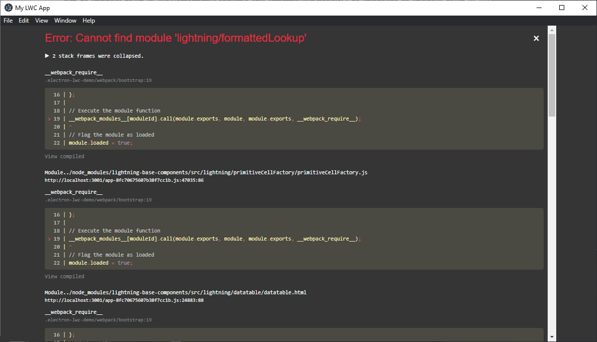

# electron-lwc-demo

This is a demo app which shows how to render salesforce data with lightning web components locally in Electron App

## How to start?

1. Run `npm install`

2. Login to the `Salesforce` org and create the `Connected App`:
   - Connected App Name: `Electron Local`
   - API Name: `Electron_Local`
   - Email: `user@user.com`
   - Enable OAuth Settings: `checked`
   - Callback URL: `http://localhost:3002/oauth2/callback`
   - Selected OAuth Scopes: `Full access`
   
   Manage:
   
   - IP Relaxation: `Relax IP restrictions`

3. Copy `Client Key` and `Client Secret` to `.env` file in root folder
4. Run `npm run watch`
5. Enjoy the app!

## Error Handling
### If you see this error after you run the command `npm run watch`

Copy `formattedLookup` component from this folder [trailheadapps
/
lwc-recipes](https://github.com/salesforce/base-components-recipes/tree/master/force-app/main/default/lwc)
to `node_modules/lightning-base-components/src/lightning` folder

Replace all findings in folder `node_modules/lightning-base-components/src/lightning`:
find `from 'c/` replace to `from 'lightning/`

